```mermaid
graph TD
    A[🎓 Current Focus] --> B[Advanced React Patterns]
    A --> C[Deep Learning with PyTorch]
    A --> D[Linux Kernel Development]
    A --> E[Distributed Systems]
    
    B --> F[🚀 Next Goals]
    C --> F
    D --> F
    E --> F
    
    F --> G[Cloud Architecture]
    F --> H[DevOps & CI/CD]
    F --> I[Advanced ML Research]
```

#  Hi there! I'm Syed Muqeet Ur Rehman

<div align="center">
  
</div>

<div align="center">
  
  [](https://linkedin.com/in/syed-muqeet-ur-rehman-a734a5358)
  [](mailto:muqeetnabila308@gmail.com)
  [](tel:03356440167)
  
</div>

##  About Me

```python
class Developer:
    def __init__(self):
        self.name = "Syed Muqeet Ur Rehman"
        self.location = "Pakistan 🇵🇰"
        self.education = "Bachelor of Computer Science - FAST NUCES Karachi"
        self.graduation_year = 2026
        self.interests = ["System Programming", "Machine Learning", "Web Development"]
        self.currently_learning = ["Advanced React", "Deep Learning", "Kernel Development"]
    
    def get_skills(self):
        return {
            "languages": ["C++", "JavaScript", "Python", "C"],
            "frontend": ["React.js", "HTML5", "CSS3", "Tailwind CSS"],
            "backend": ["Node.js", "Express.js", "Django"],
            "databases": ["PostgreSQL", "MongoDB", "SQL"],
            "tools": ["Git", "Linux", "PyTorch", "Scikit-Learn"],
            "specialties": ["System Calls", "Multi-threading", "Graph Neural Networks"]
        }
    
    def current_focus(self):
        return "Building scalable systems and exploring ML applications"

me = Developer()
```

##  GitHub Stats

<div align="center">
  
</div>

<div align="center">
  
</div>

<div align="center">
  
</div>

##  Tech Stack

<div align="center">

### Frontend


### Backend


### Database & Cloud


### Machine Learning & Tools


</div>

##  Featured Projects

<div align="center">

### 🏥 Project Sehat - Healthcare Management System
[](https://github.com/muqeet007/Project-SEHAT-OOP-Version)

**Tech Stack:** `C++` `OOP` `File Handling`
- 🔹 Modular healthcare system with automated doctor assignment
- 🔹 Health monitoring based on patient vitals
- 🔹 Persistent patient record storage

### 📚 Study Buddy - Student-Tutor Matching System
[](https://github.com/muqeet007/Project-Study-Buddy-)

**Tech Stack:** `C++` `Hash Tables` `BST` `Graph Algorithms`
- 🔹 Subject and cost-based filtering system
- 🔹 Dynamic tutor rating mechanism
- 🔹 Graph-based relationship modeling

### 🧠 Node Classification with Graph Neural Networks
[](https://github.com/muqeet007/Node-Classification-with-Basic-Graph-Neural-Networks)

**Tech Stack:** `PyTorch Geometric` `NetworkX` `GPU Computing`
- 🔹 2-layer Graph Convolutional Network implementation
- 🔹 Semi-supervised learning on Cora dataset
- 🔹 Node visualization and accuracy improvements

### 🔒 Spinlock System Call Implementation
[](https://github.com/muqeet007/Spin-Lock-System-Call-)

**Tech Stack:** `Linux Kernel` `C` `Pthreads` `System Calls`
- 🔹 Custom Linux system call with atomic operations
- 🔹 Thread-safe shared memory modification
- 🔹 Multithreaded testing with POSIX threads

### 📦 IT Inventory Management System
[](https://github.com/muqeet007/IT-Inventory)

**Tech Stack:** `PERN Stack` `JWT` `Role-based Access`
- 🔹 Full-stack inventory and sales management
- 🔹 Real-time stock updates and dashboards
- 🔹 Secure authentication with JWT

</div>

##  Certifications

<div align="center">

| Certification | Provider | Year |
|:-------------:|:--------:|:----:|
| 🎯 Meta Programming With JavaScript | Meta | 2025 |
| ⚛️ Meta React Basics | Meta | 2025 |
| 🚀 Meta React Advanced | Meta | 2025 |

</div>

##  Leadership & Activities

<div align="center">

### 🎯 FAST NUCES Involvement
- **GR Member** - FAST NUCES DEV DAY (Feb 2024 – May 2024)
- **PR Member** - FAST NUCES PROCOM (Feb 2024 – May 2024)

</div>

##  Activity Graph

<div align="center">
  
</div>

##  Current Learning Path

<div align="center">



</div>

##  Let's Connect!

<div align="center">
  
  
  
  <br/><br/>
  
  
  
  <br/><br/>
  
  **💬 "Code is like humor. When you have to explain it, it's bad." - Cory House**
  
  <br/>
  
  
  
</div>

---

<div align="center">
  
</div>
